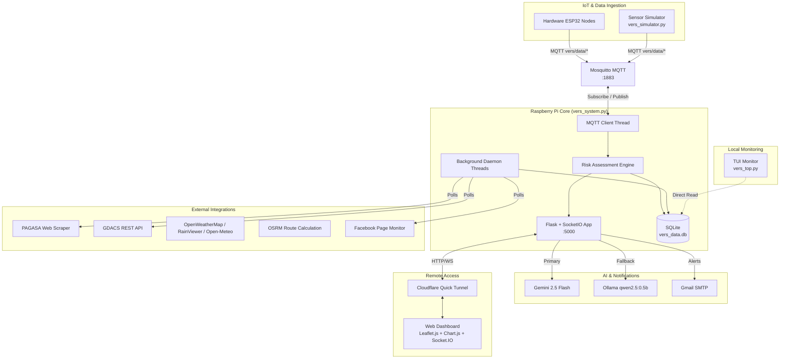
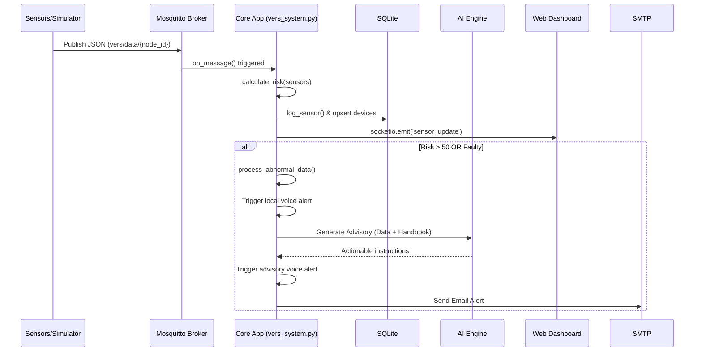

# VERS (Versatile Emergency Response System) Architecture Document

## System Overview
VERS is a real-time critical infrastructure monitoring system deployed on a Raspberry Pi in Barangay Bagumbayan, Taguig City, Philippines. It monitors distributed IoT sensor nodes for emergencies including fire, flood, gas leaks, and life form detection.

## 1. System Architecture

## 2. Architecture Components

### 2.1 Core Application (`vers_system.py`)
- **Size:** 2,234 lines
- **Framework:** Flask + Flask-SocketIO using `eventlet` async mode.
- **Binding:** `0.0.0.0:5000`
- **Data Storage:** SQLite database at `data/vers_data.db`.
- **Configuration & Logs:** `data/settings.json`, `data/audit.log`.

### 2.2 Sensor Simulator (`vers_simulator.py`)
- **Integration:** Paho MQTT client publishing to `vers/data/{node_id}` every 5 seconds.
- **Scale:** 10 virtual nodes configured at Taguig City GPS coordinates (14.46-14.47°N, 121.05-121.06°E).
- **Behavior Engine:** Emergency injection engine with a 1% chance per tick to inject sustained anomalies (3-8 ticks). Simulates fire, flood, life form presence, gas leaks, and battery drain.

### 2.3 TUI Monitor (`vers_top.py`)
- **Interface:** Curses-based terminal UI (similar to `htop`).
- **Data Access:** Reads directly from the SQLite DB.
- **Features:** Displays a node table (ID, risk, battery, fire, flood, life, gas, last seen), critical alerts (risk > 50), and system resource usage (load/memory).

### 2.4 Remote Access Tunnel
- **Components:** `start_tunnel.sh` and `send_tunnel_email.py`.
- **Function:** Launches `cloudflared tunnel --url http://localhost:5000`. Parses the dynamic `*.trycloudflare.com` URL from the tunnel logs and auto-emails the URL to the operator via Gmail SMTP.

## 3. Data Flow

### Risk Assessment Rules
The `calculate_risk(sensors)` function applies predefined heuristics:
- Fire: Risk score 100
- Flood: Risk score 90
- Life Form: Risk score 80
- Gas Leak (>200): Risk score 75
- Fault heuristics are also evaluated to flag abnormal states.

## 4. AI Pipeline Detail

The AI advisory pipeline kicks in when critical risks are detected to provide actionable instructions to operators.

- **Primary Engine:** Uses the `google.genai` SDK with the `gemini-2.5-flash` model.
- **Context Injection:** Prompts are augmented with the "VERS Critical Infrastructure Handbook v2.4" (covering protocols for fire, flood, life form, gas leak, and severe weather), alongside real-time incident data (device ID, coordinates, emergency types, risk score, raw sensors, diagnostic status).
- **Fallback Engine:** Local Ollama LLM running `qwen2.5:0.5b` via REST API at `http://localhost:11434/api/generate`.
- **Final Fallback:** Static message ("Emergency AI systems offline") if both engines fail.
- **Outputs:** AI output is translated to an automated voice alert and an email dispatch.

## 5. External Integrations

1. **PAGASA:** Web scraper (`requests` + `BeautifulSoup`) polls `pagasa.dost.gov.ph/regional-forecast/ncrprsd` every 5 min for Red/Orange/Yellow rainfall warnings, and scrapes TAMSS PDFs from `pubfiles.pagasa.dost.gov.ph/tamss/weather/`.
2. **GDACS:** REST API polling (`gdacs.org/gdacsapi/api/events/geteventlist/MAP?eventtypes=TC`) for tropical cyclone tracking.
3. **OpenWeatherMap:** Provides wind vectors and cloud overlay tiles on the map interface.
4. **RainViewer:** Provides animated rainfall radar tiles.
5. **Facebook Page Monitor:** Polls `mbasic.facebook.com/{handle}` or the Graph API every 3 min for class suspension announcements.
6. **OSRM:** Driving route calculation for evacuation paths (`router.project-osrm.org`).
7. **Open-Meteo:** Supplies real-time precipitation rate on map hover.

## 6. Database Schema (SQLite)

The system relies on 6 tables:

1. `sensor_logs`: `id` (INTEGER PK AUTO), `device_id` (TEXT), `timestamp` (TEXT), `payload` (TEXT)
2. `devices`: `id` (TEXT PK), `name` (TEXT), `last_seen` (TEXT)
3. `daily_gps`: `device_id` (TEXT), `date` (TEXT), `lat` (REAL), `lon` (REAL), `timestamp` (TEXT), PK(`device_id`, `date`)
4. `public_reports`: `id` (INTEGER PK AUTO), `report_type` (TEXT), `description` (TEXT), `lat` (REAL), `lon` (REAL), `reporter_name` (TEXT), `timestamp` (TEXT), `status` (TEXT DEFAULT 'unverified'), `image_path` (TEXT DEFAULT '')
5. `geofences`: `id` (INTEGER PK AUTO), `name` (TEXT), `coordinates` (TEXT), `created_at` (TEXT), `created_by` (TEXT DEFAULT 'operator')
6. `class_suspensions`: `id` (INTEGER PK AUTO), `level` (TEXT), `scope` (TEXT), `reason` (TEXT), `issued_by` (TEXT), `timestamp` (TEXT), `active` (INTEGER DEFAULT 1)

## 7. Background Processing & Scheduling

### Daemon Threads (4)
1. **`mqtt_thread`:** Handles the MQTT event loop (event-driven ingestion).
2. **`_daily_report_scheduler`:** Fires the daily report at 08:00 PHT (polling check every 60s).
3. **`_threat_polling_task`:** Executes the GDACS and PAGASA scrapers every 5 minutes.
4. **`_facebook_suspension_poller_task`:** Monitors configured Facebook pages every 3 minutes.

### Transient Tasks
Asynchronous executions triggered on-demand for: `email_task`, `ai_task`, and `backup_task`.

### Scheduled Jobs
- **APScheduler Cron:** Executes `request_gps_from_all()` daily at 02:00, which publishes the `REQUEST_GPS` command to the `vers/cmd/all` MQTT topic.

## 8. Infrastructure

- **Host:** Raspberry Pi (`rasp-pi`), Python 3.14.
- **Systemd Services:** 
  - `vers.service` (Main App)
  - `vers-simulator.service` (Simulator)
  - `cloudflared-tunnel.service` (Remote Access)
  - `mosquitto.service` (MQTT broker)
- **MQTT Broker:** Local Mosquitto on `localhost:1883` (No auth).
- **Public Access:** HTTPS via Cloudflare Quick Tunnel using a dynamically assigned URL.
- **Frontend Stack:** Single-page dashboard built with Leaflet.js, Chart.js, and Socket.IO.
- **Static Assets:** 
  - `static/app.js` (87KB)
  - `static/style.css` (13KB)
  - `static/provinces.json` (16MB GeoJSON for map rendering)
  - `static/tiles/` (Offline map tiles z12-z17)
