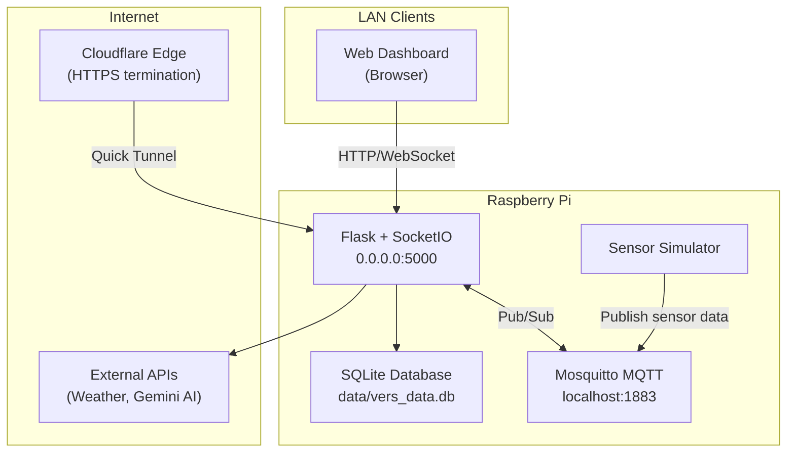

# VERS Deployment Guide

> **V**ulnerability and **E**mergency **R**esponse **S**ystem — Setup, Installation & Deployment

This guide walks through every step required to deploy VERS on a Raspberry Pi, from a bare OS image to a fully operational, remotely accessible monitoring station.

---

## Table of Contents

- [Prerequisites](#prerequisites)
- [1 — System Preparation](#1--system-preparation)
- [2 — Project Installation](#2--project-installation)
- [3 — Python Environment](#3--python-environment)
- [4 — MQTT Broker Setup](#4--mqtt-broker-setup)
- [5 — Application Configuration](#5--application-configuration)
- [6 — Gmail App Password Setup](#6--gmail-app-password-setup)
- [7 — Running the Application](#7--running-the-application)
- [8 — Systemd Services (Production)](#8--systemd-services-production)
- [9 — Cloudflare Quick Tunnel (Remote Access)](#9--cloudflare-quick-tunnel-remote-access)
- [10 — Offline Map Tiles](#10--offline-map-tiles)
- [11 — Network Architecture](#11--network-architecture)
- [12 — Security Hardening](#12--security-hardening)
- [13 — Maintenance & Operations](#13--maintenance--operations)
- [14 — Troubleshooting](#14--troubleshooting)
- [Appendix A — File Structure](#appendix-a--file-structure)
- [Appendix B — Full Dependency Table](#appendix-b--full-dependency-table)
- [Appendix C — MQTT Topic Reference](#appendix-c--mqtt-topic-reference)

---

## Prerequisites

| Requirement | Details |
|---|---|
| **Hardware** | Raspberry Pi (any model with networking) |
| **Operating System** | Debian-based Linux (Raspberry Pi OS recommended) |
| **Python** | 3.9 or higher (production uses **Python 3.14**) |
| **MQTT Broker** | Mosquitto (installed in step 4) |
| **Network** | Internet access required for external API integrations (weather, AI, Cloudflare tunnel) |
| **Storage** | ~200 MB free for application + offline tiles; database grows over time |

> [!NOTE]
> All commands in this guide assume you are logged in as the `rasp-pi` user. Adjust paths accordingly if your username differs.

---

## 1 — System Preparation

Update the system packages and install essential build tools:

```bash
sudo apt update && sudo apt upgrade -y
sudo apt install -y git python3 python3-venv python3-pip curl
```

Verify Python is at version 3.9 or above:

```bash
python3 --version
```

---

## 2 — Project Installation

Clone the repository (or copy the project files) into the home directory:

```bash
cd /home/rasp-pi
git clone <repo-url> vers_project
cd vers_project
```

Create the runtime data directory:

```bash
mkdir -p data
```

> [!TIP]
> If you received the project as an archive, extract it with `tar -xzf vers_project.tar.gz` instead of cloning.

---

## 3 — Python Environment

### 3.1 — Create a Virtual Environment

```bash
cd /home/rasp-pi/vers_project
python3 -m venv venv
source venv/bin/activate
```

### 3.2 — Install Dependencies

```bash
pip install --upgrade pip
pip install \
  flask \
  flask-socketio \
  eventlet \
  paho-mqtt \
  google-genai \
  shapely \
  numpy \
  beautifulsoup4 \
  apscheduler \
  requests \
  httpx \
  cryptography \
  PyPDF2 \
  openlocationcode
```

### 3.3 — Verify Installation

```bash
python -c "import flask, socketio, paho.mqtt, eventlet; print('All core packages OK')"
```

> [!IMPORTANT]
> Always activate the virtual environment (`source venv/bin/activate`) before running any VERS component manually. The systemd services reference the venv Python binary directly, so activation is not needed for service-managed execution.

---

## 4 — MQTT Broker Setup

VERS uses **Mosquitto** as its local MQTT message broker for communication between the sensor simulator and the main application.

### 4.1 — Install Mosquitto

```bash
sudo apt install -y mosquitto mosquitto-clients
```

### 4.2 — Enable and Start the Service

```bash
sudo systemctl enable mosquitto
sudo systemctl start mosquitto
```

### 4.3 — Verify the Broker

```bash
sudo systemctl status mosquitto
```

You should see `active (running)`. Test pub/sub connectivity:

```bash
# Terminal 1 — subscribe
mosquitto_sub -t "test/hello" &

# Terminal 2 — publish
mosquitto_pub -t "test/hello" -m "VERS MQTT OK"
```

### 4.4 — Configuration Reference

| Item | Value |
|---|---|
| Config file | `/etc/mosquitto/mosquitto.conf` |
| Log file | `/var/log/mosquitto/mosquitto.log` |
| Default port | `1883` (localhost only) |
| Authentication | None (localhost connections) |
| Persistence | Enabled (default) |

> [!NOTE]
> The default Mosquitto configuration is sufficient for VERS. No custom configuration file is required unless you need remote MQTT clients or authentication.

---

## 5 — Application Configuration

### 5.1 — Create `data/settings.json`

Create the configuration file with your actual credentials:

```bash
cat > data/settings.json << 'EOF'
{
    "smtp_server": "smtp.gmail.com",
    "smtp_port": 587,
    "sender_email": "your-email@gmail.com",
    "sender_password": "your-16-char-app-password",
    "recipient_email": "alerts@example.com",
    "api_key": "",
    "dashboard_password": "vers2024",
    "owm_api_key": "your-openweathermap-key",
    "fb_page_handle": "IloveTaguig",
    "fb_access_token": ""
}
EOF
```

> [!CAUTION]
> This file contains plaintext credentials. Restrict its permissions immediately:
> ```bash
> chmod 600 data/settings.json
> ```

### 5.2 — Configuration Fields

| Field | Required | Description |
|---|---|---|
| `smtp_server` | Yes | SMTP server hostname for sending alert emails |
| `smtp_port` | Yes | SMTP port (`587` for TLS) |
| `sender_email` | Yes | Gmail address used to send alerts |
| `sender_password` | Yes | 16-character Gmail App Password (see [Section 6](#6--gmail-app-password-setup)) |
| `recipient_email` | Yes | Destination address for alert notifications |
| `api_key` | Auto | API key for authenticating external requests — auto-generated on first run if left empty |
| `dashboard_password` | Yes | Password for dashboard login (change from default!) |
| `owm_api_key` | Yes | OpenWeatherMap API key for weather data integration |
| `fb_page_handle` | Optional | Facebook page handle for social media monitoring |
| `fb_access_token` | Optional | Facebook Graph API access token |

### 5.3 — Environment Variables (Optional Overrides)

Environment variables take precedence over `settings.json` values when set:

| Variable | Default | Description |
|---|---|---|
| `PORT` | `5000` | Port the Flask server binds to |
| `FLASK_SECRET_KEY` | `vers-super-secret-key-123` | Session signing secret |
| `SMTP_SERVER` | from settings.json | Override SMTP server |
| `SMTP_PORT` | from settings.json | Override SMTP port |
| `SENDER_EMAIL` | from settings.json | Override sender email |
| `SENDER_PASSWORD` | from settings.json | Override sender password |
| `RECIPIENT_EMAIL` | from settings.json | Override recipient email |
| `GEMINI_API_KEY` | — | **Required** for Gemini AI features; picked up by the `google-genai` SDK |

Set environment variables in the systemd service file or export them in your shell:

```bash
export GEMINI_API_KEY="your-gemini-api-key"
export FLASK_SECRET_KEY="$(python3 -c 'import secrets; print(secrets.token_hex(32))')"
```

---

## 6 — Gmail App Password Setup

VERS sends email alerts (sensor warnings, tunnel URLs, code backups) via Gmail SMTP. Modern Gmail accounts require an **App Password** instead of your regular password.

### Steps

1. Navigate to [myaccount.google.com](https://myaccount.google.com)
2. Go to **Security** → **2-Step Verification** (enable it if not already active)
3. Scroll to **App passwords** (at the bottom of the 2-Step Verification page)
4. Select **Mail** as the app and **Other** as the device, then name it `VERS`
5. Click **Generate**
6. Copy the 16-character password displayed (e.g., `abcd efgh ijkl mnop`)
7. Paste it into `data/settings.json` as the `sender_password` value, **removing all spaces**:
   ```json
   "sender_password": "abcdefghijklmnop"
   ```

> [!WARNING]
> If 2-Step Verification is disabled or the App Password is revoked, all VERS email functionality (alerts, tunnel URLs, code backups) will fail silently.

---

## 7 — Running the Application

### 7.1 — Manual Start (Development / Testing)

Start the main application:

```bash
cd /home/rasp-pi/vers_project
source venv/bin/activate
python -u vers_system.py
```

In a second terminal, start the sensor simulator:

```bash
cd /home/rasp-pi/vers_project
source venv/bin/activate
python -u vers_simulator.py
```

The dashboard is now accessible at **`http://<pi-ip-address>:5000`**.

### 7.2 — Terminal Monitor (Optional)

For a real-time terminal UI showing system status:

```bash
source venv/bin/activate
python -u vers_top.py
```

> [!TIP]
> Find your Pi's IP address with `hostname -I`. The dashboard is accessible from any device on the same LAN.

---

## 8 — Systemd Services (Production)

Systemd ensures VERS starts automatically on boot and restarts on failure.

### 8.1 — Service Unit Files

Two service files are included in the project root:

#### `vers.service` — Main Application

```ini
[Unit]
Description=VERS Critical Infrastructure Monitor
After=network.target mosquitto.service

[Service]
Type=simple
User=rasp-pi
WorkingDirectory=/home/rasp-pi/vers_project
ExecStart=/home/rasp-pi/vers_project/venv/bin/python -u vers_system.py
Restart=always
RestartSec=5
StandardOutput=journal
StandardError=journal
Environment=PYTHONUNBUFFERED=1

[Install]
WantedBy=multi-user.target
```

#### `vers-simulator.service` — Sensor Simulator

```ini
[Unit]
Description=VERS Sensor Simulator
After=network.target vers.service

[Service]
Type=simple
User=rasp-pi
WorkingDirectory=/home/rasp-pi/vers_project
ExecStart=/home/rasp-pi/vers_project/venv/bin/python -u vers_simulator.py
Restart=always
RestartSec=5
StandardOutput=journal
StandardError=journal
Environment=PYTHONUNBUFFERED=1

[Install]
WantedBy=multi-user.target
```

### 8.2 — Install Services

Use the included installer script:

```bash
bash install_service.sh
```

Or install manually:

```bash
sudo cp vers.service /etc/systemd/system/
sudo cp vers-simulator.service /etc/systemd/system/
sudo systemctl daemon-reload
sudo systemctl enable vers vers-simulator
sudo systemctl start vers vers-simulator
```

### 8.3 — Startup Order

The services enforce the following boot sequence through their `After=` directives:


### 8.4 — Service Management Commands

| Action | Command |
|---|---|
| Check status | `sudo systemctl status vers` |
| Start service | `sudo systemctl start vers` |
| Stop service | `sudo systemctl stop vers` |
| Restart service | `sudo systemctl restart vers` |
| View live logs | `sudo journalctl -u vers -f` |
| View today's logs | `sudo journalctl -u vers --since today` |
| View last 100 lines | `sudo journalctl -u vers -n 100` |
| View both services | `sudo journalctl -u vers -u vers-simulator -f` |
| Disable auto-start | `sudo systemctl disable vers` |

> [!TIP]
> Replace `vers` with `vers-simulator` or `cloudflared-tunnel` in any command above to manage the other services.

---

## 9 — Cloudflare Quick Tunnel (Remote Access)

Cloudflare Quick Tunnels expose the local Flask server to the internet without port forwarding or a static IP.

### 9.1 — Install `cloudflared`

```bash
# Download the latest cloudflared binary for ARM (Raspberry Pi)
curl -L https://github.com/cloudflare/cloudflared/releases/latest/download/cloudflared-linux-arm64 \
  -o /usr/local/bin/cloudflared

sudo chmod +x /usr/local/bin/cloudflared

# Verify installation
cloudflared --version
```

> [!NOTE]
> For 32-bit Raspberry Pi OS, use `cloudflared-linux-arm` instead of `cloudflared-linux-arm64`.

### 9.2 — How It Works

1. `start_tunnel.sh` launches `cloudflared` in quick-tunnel mode, pointing to `localhost:5000`
2. Cloudflare assigns a random `*.trycloudflare.com` subdomain
3. The script captures the generated URL
4. `send_tunnel_email.py` emails the URL to the configured operator address

### 9.3 — Systemd Service

A `cloudflared-tunnel.service` unit runs the tunnel automatically after VERS starts. It depends on `vers.service` to ensure the Flask app is ready before the tunnel opens.

### 9.4 — Important Notes

| Consideration | Details |
|---|---|
| **Ephemeral URLs** | The tunnel URL changes on every restart — check your email for the latest link |
| **HTTPS** | TLS termination is handled by Cloudflare's edge network; no local SSL certificates needed |
| **No authentication** | The tunnel exposes the dashboard publicly; rely on `dashboard_password` for access control |
| **Latency** | Expect slightly higher latency than direct LAN access due to Cloudflare routing |

---

## 10 — Offline Map Tiles

VERS includes pre-downloaded map tiles for **Taguig City** so the dashboard map remains functional without internet access.

| Property | Value |
|---|---|
| Location | `static/tiles/` |
| Zoom levels | 12 through 17 |
| Coverage | Taguig City, Metro Manila |
| Usage | Automatic fallback base layer when the online tile server is unreachable |

No additional configuration is required — the frontend automatically detects and uses offline tiles when the network is unavailable.

---

## 11 — Network Architecture



**Key points:**

- Flask binds to `0.0.0.0:5000`, making it accessible to all devices on the local network
- HTTPS is handled entirely by Cloudflare's edge — no local SSL certificates are configured
- No reverse proxy (nginx) is used for VERS; nginx on the Pi routes to a separate application
- MQTT communication stays on localhost (`127.0.0.1:1883`)

---

## 12 — Security Hardening

The default installation is configured for convenience. Before exposing VERS to the internet, apply these hardening steps:

### 12.1 — Mandatory Changes

| Item | Action |
|---|---|
| **Flask secret key** | Set `FLASK_SECRET_KEY` to a cryptographically random value (see [Section 5.3](#53--environment-variables-optional-overrides)) |
| **Dashboard password** | Change `dashboard_password` from the default `vers2024` in `data/settings.json` |
| **File permissions** | Run `chmod 600 data/settings.json` to protect credentials |

### 12.2 — Additional Recommendations

- **Restrict `data/` directory access:**
  ```bash
  chmod 700 data/
  ```
- **Rotate the API key** periodically by deleting the `api_key` value in `settings.json` and restarting — a new key will be auto-generated
- **Monitor the audit log** at `data/audit.log` for unauthorized access attempts
- **Keep dependencies updated:**
  ```bash
  source venv/bin/activate
  pip install --upgrade flask flask-socketio paho-mqtt google-genai
  ```

> [!WARNING]
> VERS does not implement rate limiting on public endpoints. If exposed to the internet via Cloudflare Tunnel, consider enabling Cloudflare's built-in rate-limiting rules in the Cloudflare dashboard.

---

## 13 — Maintenance & Operations

### 13.1 — Database

The SQLite database is located at `data/vers_data.db` (~3 MB in typical operation). Back it up periodically:

```bash
cp data/vers_data.db data/vers_data_backup_$(date +%Y%m%d).db
```

### 13.2 — Logs

| Log | Location | Description |
|---|---|---|
| Application logs | `journalctl -u vers` | stdout/stderr from `vers_system.py` |
| Simulator logs | `journalctl -u vers-simulator` | stdout/stderr from `vers_simulator.py` |
| MQTT broker logs | `/var/log/mosquitto/mosquitto.log` | Mosquitto connection and message logs |
| Audit trail | `data/audit.log` | JSON-formatted application audit events |

### 13.3 — Uploaded Files

Public report photos are stored in `static/uploads/`. Monitor disk usage:

```bash
du -sh static/uploads/
```

### 13.4 — Restarting After Configuration Changes

```bash
sudo systemctl restart vers vers-simulator
```

### 13.5 — Full System Restart Sequence

```bash
sudo systemctl restart mosquitto
sudo systemctl restart vers
sudo systemctl restart vers-simulator
# If using Cloudflare tunnel:
sudo systemctl restart cloudflared-tunnel
```

---

## 14 — Troubleshooting

### Flask won't start

```
Error: Address already in use
```

Another process is using port 5000. Find and stop it:

```bash
sudo lsof -i :5000
kill <PID>
```

### MQTT connection refused

Verify Mosquitto is running:

```bash
sudo systemctl status mosquitto
# If inactive:
sudo systemctl start mosquitto
```

### Email alerts not sending

1. Confirm `sender_email` and `sender_password` are correct in `data/settings.json`
2. Verify the App Password is still valid in your Google account
3. Check that 2-Step Verification is enabled on the Gmail account
4. Test connectivity:
   ```bash
   python3 -c "import smtplib; s = smtplib.SMTP('smtp.gmail.com', 587); s.starttls(); print('SMTP OK')"
   ```

### Gemini AI features not working

Ensure the `GEMINI_API_KEY` environment variable is set:

```bash
echo $GEMINI_API_KEY
# If empty, set it:
export GEMINI_API_KEY="your-key-here"
```

For systemd services, add the variable to the `[Service]` section of `vers.service`:

```ini
Environment=GEMINI_API_KEY=your-key-here
```

Then reload and restart:

```bash
sudo systemctl daemon-reload
sudo systemctl restart vers
```

### Dashboard not loading on LAN

1. Confirm Flask is listening on all interfaces:
   ```bash
   ss -tlnp | grep 5000
   ```
   Output should show `0.0.0.0:5000`, not `127.0.0.1:5000`.

2. Check the Pi's firewall (if enabled):
   ```bash
   sudo ufw status
   # If active, allow port 5000:
   sudo ufw allow 5000/tcp
   ```

### Service fails to start on boot

Check for dependency timing issues:

```bash
sudo journalctl -u vers -b --no-pager | head -50
```

If Mosquitto isn't ready in time, increase the restart delay in `vers.service`:

```ini
RestartSec=10
```

---

## Appendix A — File Structure

```
vers_project/
├── vers_system.py              # Main application (Flask + SocketIO + MQTT)
├── vers_simulator.py           # Virtual sensor node simulator
├── vers_top.py                 # Terminal UI monitor
├── vers.service                # Systemd unit — main application
├── vers-simulator.service      # Systemd unit — sensor simulator
├── install_service.sh          # Automated service installer
├── start_tunnel.sh             # Cloudflare quick tunnel launcher
├── send_tunnel_email.py        # Emails tunnel URL to operator
├── send_code_email.py          # Emails code backup archive
├── templates/
│   └── index.html              # Dashboard HTML template (46 KB)
├── static/
│   ├── app.js                  # Frontend application logic (87 KB)
│   ├── style.css               # Dashboard stylesheet (13 KB)
│   ├── provinces.json          # Philippine province boundaries (16 MB)
│   ├── tiles/                  # Offline map tiles (zoom 12–17)
│   └── uploads/                # User-uploaded report photos
├── data/
│   ├── settings.json           # System configuration (credentials)
│   ├── vers_data.db            # SQLite database (~3 MB)
│   └── audit.log               # JSON audit trail
├── docs/
│   └── DEPLOYMENT_GUIDE.md     # This document
└── venv/                       # Python virtual environment
```

---

## Appendix B — Full Dependency Table

| Package | Version | Purpose |
|---|---|---|
| Flask | 3.1.3 | Web framework and REST API |
| Flask-SocketIO | 5.6.1 | Real-time WebSocket communication |
| python-socketio | 5.16.3 | Socket.IO protocol implementation |
| python-engineio | 4.13.3 | Engine.IO transport layer |
| eventlet | latest | Async networking for SocketIO |
| paho-mqtt | 2.1.0 | MQTT client for sensor data pub/sub |
| google-genai | 2.11.0 | Gemini AI integration |
| shapely | 2.1.2 | Geospatial geometry operations |
| numpy | 2.5.1 | Numerical computation |
| beautifulsoup4 | 4.15.0 | Web scraping (social media feeds) |
| APScheduler | 3.11.3 | Scheduled background tasks |
| requests | 2.34.2 | HTTP client (API calls) |
| httpx | 0.28.1 | Async HTTP client |
| cryptography | 49.0.0 | Cryptographic operations |
| werkzeug | 3.1.8 | WSGI utilities (Flask dependency) |
| PyPDF2 | 3.0.1 | PDF document processing |
| openlocationcode | 1.0.1 | Google Plus Codes encoding/decoding |

---

## Appendix C — MQTT Topic Reference

| Topic Pattern | Direction | Description |
|---|---|---|
| `vers/data/+` | Sensor → Server | Inbound sensor telemetry (wildcard `+` matches sensor ID) |
| `vers/cmd/all` | Server → Sensors | Outbound commands broadcast to all sensor nodes |

**Example — subscribe to all sensor data:**

```bash
mosquitto_sub -t "vers/data/#" -v
```

**Example — publish a test sensor reading:**

```bash
mosquitto_pub -t "vers/data/sensor01" -m '{"temp": 28.5, "humidity": 72}'
```
