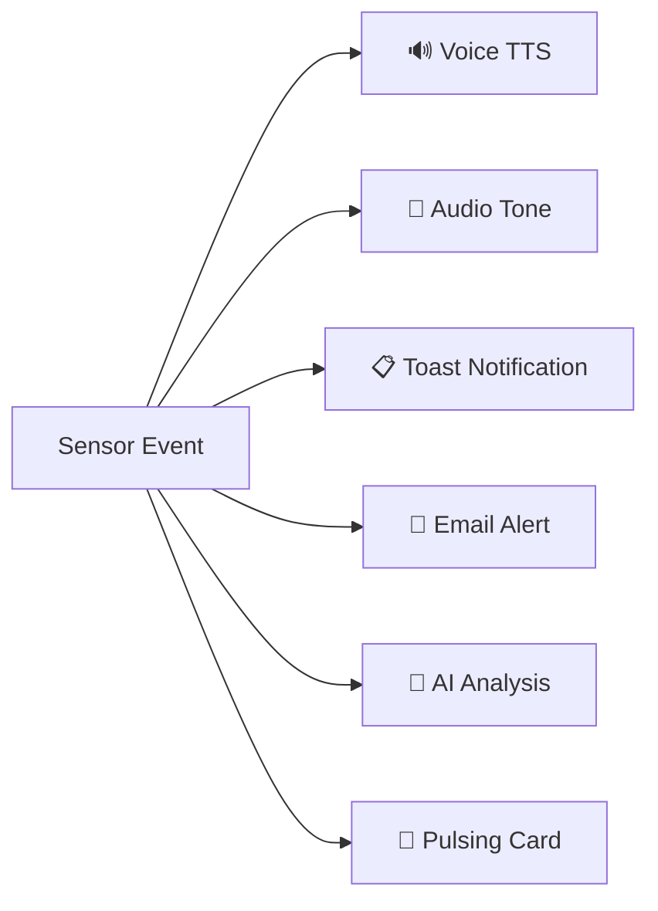

# VERS — Operator Manual

**Vigilant Early-Response System for Critical Infrastructure Monitoring**

| Document Info | |
|---|---|
| **Version** | 1.0 |
| **Last Updated** | August 2026 |
| **Audience** | VERS Dashboard Operators, System Administrators |
| **Access URL** | `http://localhost:5000` (local) or via Cloudflare Tunnel |

---

## Table of Contents

1. [Introduction](#1-introduction)
2. [Getting Started](#2-getting-started)
3. [Dashboard Overview](#3-dashboard-overview)
4. [Top Bar](#4-top-bar)
5. [Left Panel — Monitoring & Alerts](#5-left-panel--monitoring--alerts)
6. [Map — Central Display](#6-map--central-display)
7. [Right Panel — Operator Controls](#7-right-panel--operator-controls)
8. [PAGASA Marquee Ticker](#8-pagasa-marquee-ticker)
9. [Alert System](#9-alert-system)
10. [Sensor Cards — Reading Node Data](#10-sensor-cards--reading-node-data)
11. [Settings Modal](#11-settings-modal)
12. [Playback Mode](#12-playback-mode)
13. [Class Suspension Monitoring (Walang Pasok)](#13-class-suspension-monitoring-walang-pasok)
14. [Geofencing](#14-geofencing)
15. [Public Incident Reporting](#15-public-incident-reporting)
16. [Daily Operations & Automated Tasks](#16-daily-operations--automated-tasks)
17. [Audit Trail](#17-audit-trail)
18. [Troubleshooting](#18-troubleshooting)

---

## 1. Introduction

VERS (Versatile Emergency Response System) is a real-time critical infrastructure monitoring platform designed for disaster preparedness and multi-hazard emergency response. The system aggregates diverse sensor data from distributed field nodes, integrates national weather and hazard feeds, and provides operators with a unified command dashboard for situational awareness and incident management.

This manual covers every aspect of the VERS dashboard that an operator needs to perform their duties — from initial login through daily monitoring, incident response, and system configuration.

> [!IMPORTANT]
> This manual assumes the VERS server and all sensor nodes are already deployed and operational. For installation and hardware setup, refer to the separate **Deployment Guide**.

---

## 2. Getting Started

### 2.1 Accessing the Dashboard

Open a modern web browser (Chrome, Firefox, or Edge recommended) and navigate to:

- **Local Network:** `http://localhost:5000`
- **Remote Access:** Use the Cloudflare Tunnel URL provided by your system administrator.

The dashboard loads as a single-page web application. No installation is required on the client device.

### 2.2 Operator Login

Public visitors see a read-only view of the dashboard. To unlock operator controls, you must log in.

1. Click the **Login** button in the top-right corner of the top bar, or navigate directly to `/login`.
2. Enter your credentials:
   - **Username:** `operator`
   - **Password:** As configured in Settings (default: `vers2024`)
3. Click **Login**.

On successful authentication, all elements with the `.operator-only` CSS class become visible, including:

- Manual Emergency Controls
- Live Statistics card
- Public Reports Inbox
- System Health card
- Operator Broadcast card
- Class Suspension LGU override form
- Geofence drawing tools

> [!TIP]
> Change the default password immediately after first login. Go to **Settings → 📧 Email / SMTP** and update the **Dashboard Password** field.

### 2.3 Logging Out

Click the **Operator Menu** (gear icon) in the top bar and select **Logout**. All operator-only panels will be hidden and the session will be terminated.

---

## 3. Dashboard Overview

The VERS dashboard uses a three-panel layout with a central map:

```
┌──────────────────────────────────────────────────────────────────┐
│                     PAGASA MARQUEE TICKER                        │
├──────────────────────────────────────────────────────────────────┤
│                           TOP BAR                                │
├──────────┬──────────────────────────────────┬────────────────────┤
│          │                                  │                    │
│  LEFT    │                                  │   RIGHT            │
│  PANEL   │           MAP                    │   PANEL            │
│  320px   │         (flex:1)                 │   320px            │
│          │                                  │                    │
│          │                                  │                    │
│          │                                  │                    │
├──────────┴──────────────────────────────────┴────────────────────┤
```

On **mobile devices**, the sidebar panels stack below the map and all top-bar controls collapse into a hamburger menu (☰ Menu).

---

## 4. Top Bar

The top bar is the primary navigation and status strip across the top of the dashboard.

### 4.1 Left Section

| Element | Description |
|---|---|
| **Title** | "VERS - Critical Infrastructure Monitor" — identifies the application. |

### 4.2 Center Section

| Element | Description |
|---|---|
| **Live Date/Time** | Displays the current date and time, updated every second. |
| **Playback Controls** | Transport controls visible when Playback Mode is active (see [Section 12](#12-playback-mode)). |
| **System Status Badge** | Color-coded badge indicating overall system health: **green** (nominal), **yellow** (degraded), **red** (critical). |
| **Connection Indicator** | Shows the Socket.IO real-time connection state. A green dot means connected; red means disconnected. |

### 4.3 Right Section (Desktop)

| Element | Description |
|---|---|
| **Report Incident** | Link to the public incident report form (`/report`). |
| **Hazard Assessment** | Opens the HazardHunterPH crosshair mode on the map (see [Section 6.6](#66-hazardhunterph-mode)). |
| **Quick Links** | Dropdown menu with external resource links organized into three categories (see below). |
| **⏮ Playback Mode** | Toggles Playback Mode on/off. |
| **Operator Menu** | Dropdown with **Settings**, **Test Voice**, and **Logout**. |
| **Login** | Visible only when not authenticated. |

#### Quick Links Reference

| Category | Links |
|---|---|
| **Government** | PAGASA, PHIVOLCS, HazardHunterPH, DOST, NDRRMC, Project NOAH |
| **News** | ABS-CBN, GMA, Rappler, Inquirer |
| **Weather** | Windy, Earth Nullschool, Zoom Earth |

### 4.4 Mobile Layout

On screens narrower than the desktop breakpoint, all right-section controls collapse into a **☰ Menu** hamburger button. Tapping it reveals a slide-out menu containing all the same options.

---

## 5. Left Panel — Monitoring & Alerts

The left panel is a 320 px sidebar containing the primary monitoring cards, ordered top-to-bottom.

### 5.1 Global Status & Alerts

This card is the first thing an operator should monitor. It aggregates **real-time sensor alerts** from all connected nodes.

- Each alert row shows the **node ID**, **alert type** (fire, flood, gas, life form), **timestamp**, and a brief description.
- An **ACK** (Acknowledge) button appears on each unacknowledged alert.
- **Unacknowledged alerts pulse red** and are **re-announced via voice every 60 seconds** until acknowledged.

**To acknowledge an alert:**

1. Review the alert details.
2. Click the **ACK** button on the alert row.
3. The alert stops pulsing and the voice re-announcement ceases.
4. The acknowledgement is recorded in the [Audit Trail](#17-audit-trail).

> [!WARNING]
> Acknowledging an alert does **not** resolve the underlying condition. It indicates the operator is aware of and responding to the situation. If the sensor continues to detect the hazard, new alerts will be generated.

### 5.2 Class Suspensions (Walang Pasok)

Displays the current class suspension status for the monitored area.

- **Auto-derived status**: The system automatically determines suspensions from active PAGASA weather warnings (see [Section 13](#13-class-suspension-monitoring-walang-pasok)).
- **DepEd Scope**: Shows which educational levels are affected.
- **LGU Override Form** *(operator-only)*: Operators can manually post an official Local Government Unit announcement that overrides the auto-derived status.

### 5.3 Global Risk & Threat Monitoring

Aggregates external hazard data:

- **GDACS Cyclones**: Active tropical cyclone alerts from the Global Disaster Alert and Coordination System, including category, track, and affected areas.
- **PAGASA Warnings**: Current weather bulletins, rainfall advisories, and tropical cyclone warning signals.

### 5.4 Operator Broadcast *(Operator-Only)*

Allows operators to send a **text message to all connected clients** via Socket.IO broadcast.

1. Type your message in the text area.
2. Click **Send Broadcast**.
3. The message appears as a toast notification on every connected client's screen.

> [!CAUTION]
> Broadcasts are visible to **all** users — including the public. Use this for official announcements only (e.g., evacuation notices, all-clear messages).

### 5.5 Node Sensor Cards

Remaining space in the left panel displays individual sensor node cards (e.g., `Node_01`, `V-Node_01`). See [Section 10](#10-sensor-cards--reading-node-data) for a detailed breakdown of card contents.

---

## 6. Map — Central Display

The map is the visual core of VERS. It occupies the center of the dashboard with `flex: 1` sizing, filling all available horizontal space between the two sidebars.

### 6.1 Map Technology

- Built on **Leaflet.js** with a dark-mode CSS filter applied by default for reduced eye strain during extended monitoring.

### 6.2 Base Layers

Switch between base layers using the layer control in the top-right corner of the map.

| Layer | Description |
|---|---|
| **Google Roads** | Standard road map from Google. |
| **Google Satellite** | Aerial/satellite imagery. |
| **Google Hybrid** | Satellite imagery with road labels overlaid. |
| **Google Terrain** | Topographic relief with road labels. |
| **OpenTopoMap** | Open-source topographic map with contour lines. |
| **Local Offline Tiles** | Pre-cached tiles for operation without internet connectivity. |

### 6.3 Overlay Layers

Toggle overlays independently using the layer control. Multiple overlays can be active simultaneously.

| Overlay | Description |
|---|---|
| **RainViewer Radar** | Near-real-time precipitation radar imagery. |
| **Incident Heatmap** | Density visualization of historical incident locations. |
| **OWM Wind** | OpenWeatherMap wind speed/direction overlay. |
| **OWM Clouds** | OpenWeatherMap cloud cover overlay. |
| **PAR Boundary** | Philippine Area of Responsibility boundary line. |
| **GDACS Cyclones** | Active tropical cyclone positions displayed as spinning 🌀 icons with track lines. |
| **Wind Animation** | Animated wind flow particles over the map. |
| **Taguig Flood Susceptibility** | Polygon overlays showing flood susceptibility zones within Taguig City. |
| **Public Reports** | Markers for citizen-submitted incident reports. |
| **West Valley Fault** | Trace of the West Valley Fault line. |
| **Active Volcanoes** | Markers for monitored volcanoes: Taal, Mayon, Pinatubo, and Kanlaon. |

### 6.4 Evacuation Routing

VERS can automatically compute evacuation routes from any point to the nearest designated safe zone.

- Routing is powered by **OSRM** (Open Source Routing Machine).
- When a high-risk event is detected, the system draws a route line from the affected node to the nearest safe zone.
- A **turn-by-turn directions panel** opens alongside the map with step-by-step navigation instructions.

### 6.5 Live Rain Hover Tool

Hovering over any point on the map displays the **current precipitation rate** at that location, sourced from the **Open-Meteo** API. This provides immediate awareness of rainfall intensity without switching to a separate weather application.

### 6.6 HazardHunterPH Mode

Activated via the **Hazard Assessment** button in the top bar.

1. Click **Hazard Assessment** — the cursor changes to a crosshair.
2. Click any point on the map.
3. A popup displays a **site risk report** including:
   - Distance to the nearest known fault line
   - Proximity to active volcanoes
   - Local hazard susceptibility data
4. Click the button again or press **Escape** to exit crosshair mode.

### 6.7 Custom Geofence Drawing *(Operator-Only)*

Operators can draw custom polygon geofences directly on the map using the **Leaflet.Draw** toolbar. See [Section 14](#14-geofencing) for full details.

---

## 7. Right Panel — Operator Controls

The right panel is a 320 px sidebar containing operator-facing controls and public information. Operator-only cards are hidden until login.

### 7.1 Manual Emergency Controls *(Operator-Only)*

Two prominent buttons for manual override:

| Button | Action |
|---|---|
| **🚨 MANUAL EMERGENCY** | Triggers a system-wide emergency state. All clients receive an emergency alert, voice announcements activate, and the map highlights emergency status. |
| **✅ CLEAR** | Cancels the manual emergency state and returns the system to normal monitoring. |

> [!CAUTION]
> The **MANUAL EMERGENCY** button triggers alerts to **all connected users**. Use only for genuine emergencies or authorized drills. All activations are logged in the Audit Trail.

### 7.2 Live Statistics *(Operator-Only)*

Real-time operational metrics:

| Metric | Description |
|---|---|
| **Connections** | Number of currently connected WebSocket clients. |
| **Reports** | Total public reports received. |
| **Alerts** | Number of active (unacknowledged) alerts. |
| **Time Range** | Configurable period for the displayed statistics. |

### 7.3 Public Reports Inbox *(Operator-Only)*

Displays citizen-submitted incident reports in reverse chronological order. Each report card includes:

- **Report type** (Flood, Fire, Landslide, etc.)
- **Description** text
- **Photo preview** (if attached)
- **GPS map link** — click to center the map on the report location
- **SMS forward link** — tap to forward report details via SMS to emergency services

See [Section 15](#15-public-incident-reporting) for the full reporting workflow.

### 7.4 System Health *(Operator-Only)*

Monitors internal system components:

| Component | Indicator |
|---|---|
| **Socket Server** | Online/offline status of the Socket.IO server. |
| **AI Engine** | Status of the AI analysis engine (used for dispatch recommendations). |
| **Emergency Services** | Toggle switch to enable/disable automatic forwarding of alerts to emergency services. |

### 7.5 Public Info & Assessment *(Visible to All)*

This card is visible to unauthenticated (public) users and provides:

- **Legend**: Explains map marker icons and color coding.
- **Assess My Location**: Button that activates HazardHunterPH mode centered on the user's GPS position.
- **Submit Report**: Link to the public incident report form (`/report`).

### 7.6 Additional Node Sensor Cards

Any node cards that do not fit in the left panel overflow into the right panel.

---

## 8. PAGASA Marquee Ticker

A scrolling horizontal banner positioned at the top of the dashboard displays **live weather bulletins** sourced from PAGASA (Philippine Atmospheric, Geophysical and Astronomical Services Administration).

- The ticker updates automatically as new bulletins are published.
- Bulletins include tropical cyclone advisories, rainfall warnings, and severe weather alerts.
- The ticker scrolls continuously from right to left.

---

## 9. Alert System

VERS employs a multi-channel alert system to ensure operators are immediately aware of critical events.

### 9.1 Alert Channels



### 9.2 Voice Alerts (TTS)

- Powered by the browser's **SpeechSynthesis API**.
- Announces the alert type, node ID, and severity in spoken English.
- Test the voice output via **Operator Menu → Test Voice**.

### 9.3 Custom Audio Tones

Each alert type has a distinct synthesized audio signature generated via the **Web Audio API**:

| Alert Type | Tone Pattern | Description |
|---|---|---|
| **Fire** | 880 Hz beeps | Rapid high-pitched beeping pattern. |
| **Flood** | 300 → 150 Hz sweep | Descending frequency sweep, mimicking a siren. |
| **Gas** | 440 Hz wobble | Oscillating mid-frequency tone. |
| **Life Form** | 600 Hz beeps | Rhythmic beeping at moderate pitch. |

### 9.4 Toast Notifications

- Floating notification cards appear at the **top-center** of the screen.
- Each toast shows the alert summary and auto-dismisses after a configurable timeout.
- Multiple toasts stack vertically.

### 9.5 AI Analysis Panel

When a critical alert fires, the AI engine generates a preliminary analysis and recommended dispatch action:

1. The AI analysis appears in an **editable textarea** within the alert detail panel.
2. The operator can review, modify, or augment the AI recommendation.
3. Click **Dispatch** to send the finalized instruction.

### 9.6 Email Alerts

- Critical incidents automatically trigger email alerts to the configured recipient address.
- Email configuration is managed in **Settings → 📧 Email / SMTP**.

### 9.7 Alert Lifecycle

1. **Trigger**: A sensor reading exceeds its configured threshold.
2. **Announce**: Voice TTS, audio tone, and toast notification fire simultaneously.
3. **Pulse**: The alert card and associated sensor card pulse red.
4. **Re-announce**: If not acknowledged within **60 seconds**, the voice and tone repeat.
5. **Acknowledge**: Operator clicks **ACK** — pulsing and re-announcement stop.
6. **Log**: The alert and its acknowledgement are recorded in the Audit Trail.

> [!IMPORTANT]
> Alerts continue to re-announce every 60 seconds until explicitly acknowledged. This ensures no critical event goes unnoticed, even if the operator is momentarily away from the screen.

---

## 10. Sensor Cards — Reading Node Data

Each deployed sensor node is represented by a card in the sidebar. Understanding how to read these cards is fundamental to effective monitoring.

### 10.1 Card Layout

```
┌─────────────────────────────────┐
│  Node_01                   🔋 85%│
│  ██████████████░░░░  (battery)  │
├─────────────────────────────────┤
│  Risk Score: ██████░░░░  62/100 │
│  🔥 Fire:      CLEAR            │
│  🌊 Flood:     CLEAR            │
│  👤 Life Form: DETECTED         │
│  💧 Humidity:  78%              │
│  💨 Gas:       120 PPM          │
├─────────────────────────────────┤
│  ┌─ Gas Trend ──────────────┐   │
│  │  ╱╲    ╱╲               │   │
│  │ ╱  ╲╱╱  ╲╲__           │   │
│  └──────────────────────────┘   │
│  ┌─ Battery Trend ──────────┐   │
│  │ ‾‾‾‾‾╲                  │   │
│  │        ╲____             │   │
│  └──────────────────────────┘   │
│           [📷 CAM]              │
└─────────────────────────────────┘
```

### 10.2 Field Reference

| Field | Range | Description |
|---|---|---|
| **Risk Score** | 0–100 | Composite risk assessment. **0–39** = Green (low). **40–69** = Yellow (moderate). **70–100** = Red (high/critical). |
| **Fire Status** | CLEAR / DETECTED | Binary fire detection from onboard sensor. |
| **Flood Status** | CLEAR / DETECTED | Binary flood detection from water-level sensor. |
| **Life Form** | CLEAR / DETECTED | Indicates human/animal presence in the node's detection zone. |
| **Humidity** | 0–100% | Ambient relative humidity. |
| **Gas PPM** | 0–10,000+ | Concentration of hazardous gases in parts per million. |
| **Battery** | 0–100% | Remaining battery charge shown as a progress bar. |

### 10.3 Sparkline Trend Charts

Two SVG sparkline charts at the bottom of each card visualize the **last 20 readings** for:

- **Gas PPM** — helps identify trending gas leaks before they reach the alert threshold.
- **Battery** — tracks discharge rate to anticipate node power failures.

### 10.4 ESP32-CAM Stream

If the node is equipped with an ESP32-CAM module:

1. Click the **📷 CAM** button on the sensor card.
2. A live MJPEG video stream opens inline or in a popup.
3. Click again to stop the stream.

> [!NOTE]
> The ESP32-CAM IP address is configured in **Settings → ⚙️ Thresholds**. Ensure the camera module is on the same network or properly port-forwarded.

---

## 11. Settings Modal

Access the Settings modal via **Operator Menu → Settings** in the top bar. The modal contains **six tabs**, each controlling a different aspect of system behavior.

### 11.1 📧 Email / SMTP

Configure outbound email for alerts and daily reports.

| Field | Description |
|---|---|
| **SMTP Server** | Hostname of your mail server (e.g., `smtp.gmail.com`). |
| **SMTP Port** | Port number (e.g., `587` for TLS, `465` for SSL). |
| **Sender Email** | The "from" address for outgoing emails. |
| **Sender Password** | App-specific password or SMTP credential for the sender account. |
| **Recipient Email** | The address that receives alert and report emails. |
| **Dashboard Password** | Change the operator login password. |
| **Facebook Page Handle** | The LGU Facebook page to poll for class suspension announcements (default: `@IloveTaguig`). |

> [!TIP]
> If using Gmail, generate an **App Password** under your Google account security settings rather than using your primary password.

### 11.2 🗺️ Display

Toggle visual elements on the map and dashboard.

| Toggle | Description |
|---|---|
| **Emergency Services Markers** | Show/hide markers for fire stations, hospitals, and police stations on the map. |
| **Safe Zones** | Show/hide designated evacuation safe zone polygons. |
| **TTS Voice** | Enable/disable spoken voice alerts. When disabled, only audio tones and visual alerts fire. |

### 11.3 💾 Backup

| Action | Description |
|---|---|
| **Trigger Email Backup** | Compresses all system data files (configurations, logs, sensor history, reports) into a ZIP archive and emails it to the configured recipient address. |

Backups include:

- Sensor history database
- Configuration files
- Audit logs
- Incident reports and attached photos
- Geofence definitions

### 11.4 🧪 Simulator

Inject synthetic sensor data for testing and training purposes. This is invaluable for drills and for verifying alert behavior without requiring a physical sensor event.

| Field | Description |
|---|---|
| **Life Form** | Toggle simulated life-form detection. |
| **Flood** | Toggle simulated flood detection. |
| **Fire** | Toggle simulated fire detection. |
| **Gas (slider)** | Set a simulated gas PPM value (0–10,000). |
| **Battery** | Set a simulated battery percentage. |
| **Latitude / Longitude** | Set the GPS coordinates of the simulated event. |

**To run a simulation:**

1. Open **Settings → 🧪 Simulator**.
2. Configure the desired sensor values.
3. Click **Inject**.
4. The dashboard processes the simulated data exactly as it would real sensor input.

> [!WARNING]
> Simulated data triggers real alerts, voice announcements, and email notifications unless those channels are temporarily disabled. Coordinate with your team before running simulations.

### 11.5 ⚙️ Thresholds

Fine-tune detection sensitivity and hardware configuration.

| Field | Description |
|---|---|
| **Gas PPM Threshold** | The gas concentration (in PPM) above which an alert is triggered. |
| **Flood Toggle** | Enable/disable flood detection alerts globally. |
| **Fire Toggle** | Enable/disable fire detection alerts globally. |
| **ESP32-CAM IP** | IP address of the ESP32-CAM module for live video streaming. |

### 11.6 📊 Analytics

Generate historical analysis and visualizations.

| Field | Description |
|---|---|
| **Time Range Selector** | Choose the historical period to analyze (e.g., last 24 hours, 7 days, 30 days, custom range). |
| **Generate Heatmap** | Creates a density heatmap overlay on the map showing incident concentration over the selected period. |

---

## 12. Playback Mode

Playback Mode allows operators to review historical sensor states and incident timelines — essential for post-incident analysis and reporting.

### 12.1 Entering Playback Mode

1. Click the **⏮ Playback Mode** button in the top bar.
2. The button highlights to indicate Playback Mode is active.
3. **Real-time updates are paused** — the dashboard stops processing live sensor data.
4. Historical data is fetched from the `/api/history` endpoint.

### 12.2 Using the Timeline

- A **slider timeline** appears below the top bar.
- Drag the slider left or right to scrub through past sensor states.
- As you scrub, the dashboard replays:
  - **Map marker positions** — nodes move to their historical GPS coordinates.
  - **Sensor card values** — all readings update to reflect the selected point in time.
  - **Alert states** — historical alerts are shown as they occurred.

### 12.3 Exiting Playback Mode

1. Click the **⏮ Playback Mode** button again.
2. The dashboard resumes real-time monitoring and reconnects to the live data stream.

> [!IMPORTANT]
> While Playback Mode is active, **no live alerts will be displayed or announced**. Ensure another operator is monitoring the live dashboard if you need to review historical data during an active monitoring shift.

---

## 13. Class Suspension Monitoring (Walang Pasok)

VERS automates the monitoring and dissemination of class suspension announcements — a critical public safety function during severe weather events in the Philippines.

### 13.1 Automatic Derivation from PAGASA Warnings

The system maps PAGASA Tropical Cyclone Warning Signals to DepEd class suspension levels:

| PAGASA Signal | Suspension Scope |
|---|---|
| 🔴 **Red Warning** | All levels suspended (Pre-School through College) |
| 🟠 **Orange Warning** | Pre-School to Senior High School suspended |
| 🟡 **Yellow Warning** | Pre-School and Kindergarten suspended |

These are derived automatically and require no operator action.

### 13.2 LGU Override (Operator Action)

Local Government Units may issue suspension announcements that differ from or supplement the PAGASA-derived status.

1. Locate the **Class Suspensions** card in the left panel.
2. Fill in the LGU announcement form:
   - Scope of suspension
   - Effective date/time
   - Source / authority
3. Click **Post Announcement**.
4. The override is broadcast to all connected clients via Socket.IO in real time.

### 13.3 Facebook Page Auto-Polling

VERS continuously polls the configured LGU Facebook page (default: **@IloveTaguig**) for class suspension posts. When a relevant post is detected, the suspension status updates automatically.

To change the monitored page:

1. Go to **Settings → 📧 Email / SMTP**.
2. Update the **Facebook Page Handle** field.
3. Click **Save**.

---

## 14. Geofencing

Geofences define monitored geographic boundaries that trigger alerts when conditions change within them.

### 14.1 Drawing Custom Geofences

1. Log in as operator.
2. Locate the **Leaflet.Draw** toolbar on the left side of the map.
3. Click the **polygon tool** (pentagon icon).
4. Click points on the map to define the polygon vertices.
5. Double-click or click the first point to close the polygon.
6. A dialog prompts you to **name the geofence**.
7. Click **Save** — the geofence is persisted via the `/api/geofence` endpoint.

### 14.2 Automatic Danger Zones

VERS automatically generates **300-meter radius danger zones** around any node whose risk score exceeds **60**.

- These zones appear as translucent red circles on the map.
- **Cyan dashed lines** are drawn from each danger zone to the **nearest emergency facility** (fire station, hospital, or police station), providing a visual reference for response routing.
- Danger zones update dynamically as risk scores change.

### 14.3 Managing Geofences

- Existing geofences can be edited or deleted using the Leaflet.Draw toolbar's edit and delete modes.
- All geofence changes are logged in the Audit Trail.

---

## 15. Public Incident Reporting

Citizens can submit incident reports through the VERS platform, creating a crowdsourced layer of situational awareness.

### 15.1 Report Submission (Public Side)

1. Navigate to `/report` (or click **Submit Report** on the dashboard).
2. Fill in the report form:

| Field | Required | Description |
|---|---|---|
| **Type** | Yes | Incident category: Flood, Fire, Landslide, Earthquake, or Other. |
| **Description** | Yes | Free-text description of the incident. |
| **GPS Location** | Auto | Automatically detected via browser geolocation. Can be manually adjusted. |
| **Name** | No | Reporter's name (optional, for follow-up). |
| **Photo** | No | Attach a photo of the incident. |

3. Click **Submit Report**.

### 15.2 Operator Inbox Processing

Submitted reports appear in the **Public Reports Inbox** in the right panel.

For each report, the operator can:

1. **Review** the report details and attached photo.
2. **View on map** — click the GPS link to center the map on the report location. The report marker appears on the map in real time.
3. **Forward via SMS** — click the SMS link to open the device's SMS app with pre-filled report details, ready to forward to emergency services.
4. **Take action** — coordinate response based on the report content and current operational picture.

---

## 16. Daily Operations & Automated Tasks

VERS performs several automated tasks to maintain operational readiness.

### 16.1 Automated Schedule

| Time (PHT) | Task | Description |
|---|---|---|
| **02:00** | GPS Request | A GPS coordinate request is sent to all sensor nodes via MQTT. Nodes respond with their current position, updating map markers. |
| **08:00** | Daily Summary Email | An automated report is compiled and emailed to the configured recipient. Contents include device event counts, maximum risk scores, and notable incidents from the past 24 hours. |

### 16.2 Manual Report Generation

Operators can generate a summary report on demand:

1. Open the **Operator Menu** in the top bar.
2. Select **Generate Report** (or the equivalent menu item).
3. The report is compiled and emailed immediately.

### 16.3 Recommended Daily Checklist

Operators should perform the following checks at the start of each shift:

- [ ] Verify the **Connection Indicator** shows green (connected).
- [ ] Check **System Health** card — confirm Socket Server and AI Engine are online.
- [ ] Review and acknowledge any **pending alerts** in the Global Status & Alerts card.
- [ ] Confirm all **sensor node cards** are reporting recent data (no stale timestamps).
- [ ] Check **battery levels** on all nodes — flag any below 20% for field maintenance.
- [ ] Review the **Public Reports Inbox** for unprocessed citizen reports.
- [ ] Verify the **PAGASA Marquee Ticker** is scrolling (confirms external data feed is active).
- [ ] Confirm **Emergency Services** toggle in System Health is set to the correct state.

---

## 17. Audit Trail

All operator actions are logged to `data/audit.log` for accountability and post-incident review.

### 17.1 Logged Events

| Event Type | Details Recorded |
|---|---|
| **Login / Logout** | Timestamp, IP address. |
| **Settings Changes** | Which setting was changed, old value, new value. |
| **Dispatches** | AI analysis text, operator modifications, dispatch target. |
| **Broadcasts** | Message content, timestamp, number of recipients. |
| **Acknowledgements** | Alert ID, node ID, alert type, time to acknowledge. |
| **Backups** | Timestamp, file size, recipient email. |
| **Reports** | Manual report generation triggers. |
| **Emergency Controls** | Manual Emergency activation/deactivation. |
| **Geofence Changes** | Create, edit, and delete operations on geofences. |

### 17.2 Viewing the Audit Trail

The audit log is viewable directly in the **operator panel** on the dashboard. Entries are displayed in reverse chronological order with filtering capabilities.

The raw log file is stored at `data/audit.log` and can also be included in email backups (see [Section 11.3](#113--backup)).

---

## 18. Troubleshooting

### 18.1 Common Issues

| Symptom | Likely Cause | Resolution |
|---|---|---|
| Connection indicator is red | Socket.IO connection lost | Check server process. Refresh the browser. Verify network connectivity. |
| No voice alerts playing | Browser TTS blocked or disabled | Ensure the browser tab has audio permissions. Check **Settings → 🗺️ Display → TTS Voice** is enabled. Click **Operator Menu → Test Voice** to verify. |
| Sensor card shows stale data | Node offline or MQTT disconnect | Check node battery level. Verify MQTT broker is running. Inspect node hardware in the field. |
| PAGASA ticker not scrolling | External API unreachable | Verify internet connectivity. The ticker will resume automatically when the PAGASA feed is reachable. |
| Email alerts not sending | SMTP misconfiguration | Go to **Settings → 📧 Email / SMTP** and verify all fields. Check sender password (use app-specific password for Gmail). |
| ESP32-CAM stream not loading | Incorrect IP or camera offline | Verify the IP in **Settings → ⚙️ Thresholds → ESP32-CAM IP**. Ensure the camera is powered and on the network. |
| Map tiles not loading | Internet required for online tiles | Switch to **Local Offline Tiles** base layer if operating without internet. |
| Login fails | Incorrect password | Confirm password with system administrator. If forgotten, it must be reset in the server configuration. |

### 18.2 Emergency Contacts

Maintain a current list of emergency contacts accessible to all operators:

- **System Administrator**: (configure locally)
- **NDRRMC Hotline**: (02) 8911-5061
- **BFP (Fire)**: 160
- **PNP (Police)**: 117
- **Red Cross**: 143

---

> [!NOTE]
> This document covers the VERS Dashboard application as of version 1.0. Features and interface elements may change in future releases. Report any discrepancies between this manual and the live system to the development team.
