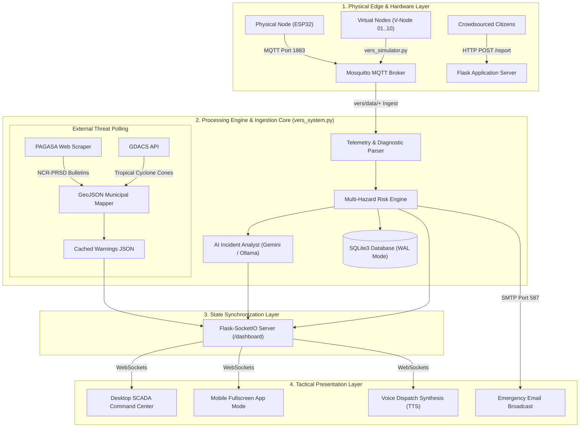
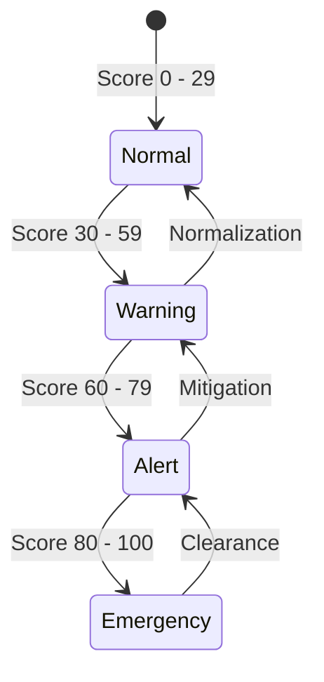
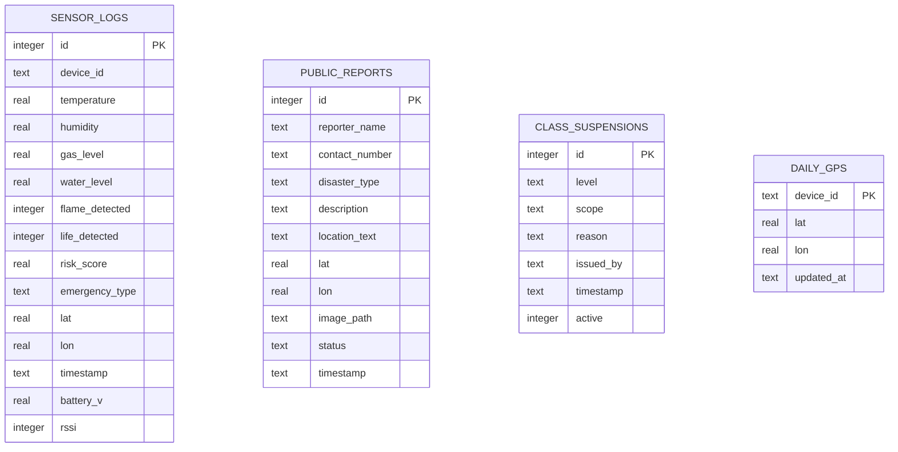

# VERS: Versatile Emergency Response System
## Comprehensive Technical Architecture, Multi-Sensor Risk Matrix & Operations Manual
**Document Version:** 3.0.0 | **Classification:** Critical Infrastructure Engineering Specification | **Date:** September 2026

---

## Table of Contents
1. [Executive Summary & System Genesis](#1-executive-summary--system-genesis)
2. [High-Level Architecture & Data Flow](#2-high-level-architecture--data-flow)
3. [Complete Codebase Directory Structure](#3-complete-codebase-directory-structure)
4. [Hardware Edge Layer & MQTT Telemetry Specification](#4-hardware-edge-layer--mqtt-telemetry-specification)
5. [Multi-Hazard Algorithmic Risk Engine](#5-multi-hazard-algorithmic-risk-engine)
6. [External Disaster Intelligence & Warning Feeds](#6-external-disaster-intelligence--warning-feeds)
7. [Core Backend Server Engine (`vers_system.py`)](#7-core-backend-server-engine-vers_systempy)
8. [High-Performance GIS & Tactical Frontend (`static/app.js` & `templates/index.html`)](#8-high-performance-gis--tactical-frontend)
9. [Mobile App Mode & Bottom Drawer Architecture](#9-mobile-app-mode--bottom-drawer-architecture)
10. [Autonomous Emergency Dispatch & Voice Synthesis](#10-autonomous-emergency-dispatch--voice-synthesis)
11. [Public Incident Reporting & Crowdsourced Intelligence](#11-public-incident-reporting--crowdsourced-intelligence)
12. [Security, Authentication & Role-Based Access Control](#12-security-authentication--role-based-access-control)
13. [Database Architecture & Data Persistence](#13-database-architecture--data-persistence)
14. [Full REST API & WebSocket Protocol Reference](#14-full-rest-api--websocket-protocol-reference)
15. [Production Deployment, Service Management & Cloudflare Tunneling](#15-production-deployment-service-management--cloudflare-tunneling)

---

## 1. Executive Summary & System Genesis

### 1.1 The Acronym & Mission
**VERS** stands for **Versatile Emergency Response System**. 

The name **Versatile** directly embodies the system's foundational philosophy: disaster response cannot rely on single-point monitoring. A flash flood is often accompanied by electrical hazards; an earthquake can trigger structural fires and gas ruptures; a tropical storm unleashes torrential rainfall, violent wind shear, and prolonged power outages.

VERS was engineered as an all-in-one, edge-deployed critical infrastructure monitoring and automated emergency dispatch platform. Operating continuously on an energy-efficient Raspberry Pi edge appliance, VERS unifies:
1. **Multi-Sensor IoT Hardware Arrays**: Real-time physical telemetry spanning flood depth, flammable gas leaks, open flames, temperature spikes, humidity, structural vibration/motion, and GNSS coordinates.
2. **National & Global Meteorological Feeds**: Automated background scrapers extracting municipality-level heavy rainfall bulletins from the Philippine Atmospheric, Geophysical and Astronomical Services Administration (**PAGASA**) and tropical cyclone forecast cones from the Global Disaster Alert and Coordination System (**GDACS**).
3. **Generative Artificial Intelligence (AI)**: On-premise and cloud intelligence (Google Gemini 2.5 Flash with local Ollama fallback) generating instantaneous, context-aware disaster response plans for emergency dispatchers.
4. **Multi-Channel Dispatch**: Automated text-to-speech voice broadcasts over station audio systems, instant multi-recipient SMTP email dispatches, and real-time WebSocket tactical feeds.

### 1.2 Deployment Target & Strategic Domain
Originally developed with a primary operational focus on **Barangay Bagumbayan, Taguig City, Metro Manila, Philippines** (a dense urban-lakeshore zone along Laguna de Bay susceptible to seasonal monsoonal inundation), VERS features dynamic geospatial scaling. Its GIS rendering engine seamlessly scales from ultra-local street-level sensors (0–500m) to regional multi-province threat zones (National Capital Region, Central Luzon, and CALABARZON).

---

## 2. High-Level Architecture & Data Flow



---

## 3. Complete Codebase Directory Structure

```text
/home/rasp-pi/vers_project/
├── .gitignore                      # Security exclusions (DBs, credentials, venv, caches)
├── README.md                       # Project overview and quickstart guide
├── requirements.txt                # Pinned Python package dependencies
├── install_service.sh              # Automated bash deployment installer for systemd
├── start_tunnel.sh                 # Cloudflare Quick Tunnel orchestration wrapper
├── send_tunnel_email.py            # Automated remote tunnel URL dispatcher via SMTP
├── vers.service                    # Systemd service unit for production Flask backend
├── vers-simulator.service          # Systemd service unit for background hardware simulator
├── vers_system.py                  # Core production application server (2,500+ lines)
├── vers_simulator.py               # ESP32 multi-node IoT telemetry & stress simulator
├── vers_top.py                     # High-performance ncurses terminal telemetry monitor
│
├── data/                           # Persistent application state directory
│   ├── .gitkeep                    # Directory preservation
│   ├── settings.example.json       # Sanitized configuration template
│   ├── settings.json               # Local runtime settings (Git ignored)
│   ├── vers_data.db                # SQLite3 primary database (WAL mode, Git ignored)
│   └── audit.log                   # Security and operator action audit trail (Git ignored)
│
├── docs/                           # Complete technical documentation suite
│   ├── README.md                   # Documentation index and executive summary
│   ├── ARCHITECTURE.md             # In-depth system architecture & data pipeline
│   ├── API_REFERENCE.md            # REST endpoints and WebSocket event specifications
│   ├── DEPLOYMENT_GUIDE.md         # Bare-metal Raspberry Pi OS installation guide
│   ├── OPERATOR_MANUAL.md          # Command dashboard manual for LDRRMO dispatchers
│   ├── SENSOR_PROTOCOL.md          # MQTT payload schema & hardware pinout guide
│   ├── TROUBLESHOOTING.md          # Incident recovery & diagnostic runbooks
│   └── VERS_COMPLETE_SYSTEM_SPECIFICATION.md # Comprehensive 10k architectural spec (This document)
│
├── static/                         # Static web assets & client-side scripts
│   ├── app.js                      # Core Leaflet GIS, WebSocket & UI client engine (1,900+ lines)
│   ├── style.css                   # Cyberpunk / Palantir Gotham dark design system
│   ├── municities.json             # High-definition GeoJSON boundaries for Philippine municipalities
│   ├── provinces.json              # High-definition GeoJSON boundaries for Philippine provinces
│   ├── tiles/                      # Offline cached Leaflet tile backup (Taguig area)
│   └── uploads/                    # Local storage for incident report photo evidence
│
└── templates/                      # HTML5 Jinja templates
    └── index.html                  # Master responsive dispatch dashboard template (700+ lines)
```

---

## 4. Hardware Edge Layer & MQTT Telemetry Specification

### 4.1 Physical Hardware Configuration (ESP32 Node)
The physical hardware node (`Node_01`) is built upon the dual-core **ESP32-WROOM-32** microcontroller operating at 240MHz. It interfaces with an array of industrial and environmental sensors:

| Sensor Module | Physical Interface | Target Phenomenon | Operational Thresholds |
| :--- | :--- | :--- | :--- |
| **HC-SR04 / JSN-SR04T** | GPIO Trig/Echo | Flood Water Height | Water height measured in cm (Critical: > 50 cm) |
| **MQ-2 Sensor** | ADC (Analog In) | Flammable Gas, Smoke, LPG | Raw ADC 0–4095 calibrated to ppm (Alert: > 400 ppm) |
| **Flame Sensor (IR)** | Digital In (GPIO) | Open Fire / Flame Emission | Active LOW on infrared flame detection |
| **DHT22 (AM2302)** | Single-Wire Digital | Ambient Heat & Humidity | -40°C to +80°C (±0.5°C), 0–100% RH (±2%) |
| **NEO-6M / NEO-8M** | UART Serial (TX/RX) | GNSS Latitude / Longitude | 5Hz update rate, NMEA-0183 sentences |
| **RCWL-0516 / PIR** | Digital In (GPIO) | Doppler Microwave Life Form | High on human movement in disaster rubble |

### 4.2 MQTT Telemetry Payload Structure
Nodes publish telemetry at 2-second intervals to the topic `vers/data/{DEVICE_ID}`. The broker operates over standard MQTT QoS 1 on port 1883.

#### Standard Telemetry Payload (JSON)
```json
{
  "device_id": "Node_01",
  "temperature": 29.4,
  "humidity": 78.2,
  "gas_level": 142.0,
  "water_level": 12.5,
  "flame_detected": false,
  "life_detected": true,
  "lat": 14.5176,
  "lon": 121.0509,
  "timestamp": "2026-09-04 10:15:30",
  "diagnostic": {
    "ip": "192.168.100.188",
    "rssi": -58,
    "battery_v": 4.12,
    "uptime_s": 84920,
    "packet_loss_pct": 0.0
  }
}
```

---

## 5. Multi-Hazard Algorithmic Risk Engine

### 5.1 The Composite Risk Scoring Algorithm
Every incoming telemetry frame is evaluated in real time by the mathematical Risk Engine in `vers_system.py`. Risk is scored on a normalized scale from **0.0 to 100.0**:

$$\text{Total Risk Score} = \min\left(100.0, \sum_{i} W_i \cdot S_i + B_{\text{compound}}\right)$$

Where individual sensor scores $S_i$ and weights $W_i$ are structured as:

1. **Fire & Thermal Component ($W_{\text{fire}} = 0.40$):**
   * If `flame_detected == true`: $S_{\text{flame}} = 100.0$
   * Ambient Temperature Spike ($T > 45^\circ\text{C}$): $S_{\text{temp}} = \min\left(100.0, \frac{T - 45}{35} \times 100\right)$
2. **Flood Submersion Component ($W_{\text{flood}} = 0.35$):**
   * Water level $H$ (cm):
     $$S_{\text{flood}} = \begin{cases} 0 & H < 10\text{ cm} \\ \frac{H - 10}{60} \times 100 & 10 \le H \le 70\text{ cm} \\ 100.0 & H > 70\text{ cm} \end{cases}$$
3. **Gas / Toxic Smoke Component ($W_{\text{gas}} = 0.25$):**
   * Raw Gas Level $G$ (ppm):
     $$S_{\text{gas}} = \begin{cases} 0 & G < 200 \\ \frac{G - 200}{800} \times 100 & 200 \le G \le 1000 \\ 100.0 & G > 1000 \end{cases}$$
4. **Compound Catastrophe Multiplier ($B_{\text{compound}}$):**
   * If both **Flame** and **High Gas** are detected concurrently: $+25.0$ risk points (Explosion Threat).
   * If **Flood** exceeds 50cm and **Life Form** is detected: $+20.0$ risk points (Trapped Survivor / Urgent Rescue).

### 5.2 Dynamic Risk Severity Classification



* **🟢 Normal (0 – 29)**: Operational baseline. Green pulsing indicators. No automated dispatch.
* **🟡 Warning (30 – 59)**: Elevated readings (e.g. rising flood stage, high ambient heat). Orange visual border on node cards.
* **🟠 Alert (60 – 79)**: Significant hazard detected. System automatically draws **300m danger exclusion zones** on the Leaflet map and queues automated email alerts.
* **🔴 Emergency (80 – 100)**: Imminent life-safety threat (e.g. active fire, rapid deep inundation). Voice synthesis triggers immediate audio sirens, dispatches high-priority SMTP alerts, and engages AI evacuation routing.

---

## 6. External Disaster Intelligence & Warning Feeds

VERS integrates live national and international disaster monitoring APIs into its GIS pipeline via background green threads.

### 6.1 PAGASA Heavy Rainfall Warning Scraper
VERS maintains an active scraper targeting the **PAGASA NCR-PRSD** regional weather bulletin. It parses official bulletins (such as Southwest Monsoon / Habagat warnings) using natural language regular expressions:

```python
def parse_pagasa_bulletin(text, all_provinces):
    # Regex extractors for Red, Orange, Yellow, and Advisory levels
    red_match = re.search(r'RED WARNING LEVEL:\s*(.*?)(?=ASSOCIATED|ORANGE|YELLOW|Meanwhile|$)', text, re.IGNORECASE | re.DOTALL)
    orange_match = re.search(r'ORANGE WARNING LEVEL:\s*(.*?)(?=ASSOCIATED|YELLOW|RED|Meanwhile|$)', text, re.IGNORECASE | re.DOTALL)
    yellow_match = re.search(r'YELLOW WARNING LEVEL:\s*(.*?)(?=ASSOCIATED|Meanwhile|RED|ORANGE|$)', text, re.IGNORECASE | re.DOTALL)
    light_match = re.search(r'Meanwhile,?\s*light to moderate.*?\s*affecting\s*(.*?)(?=which may persist|$)', text, re.IGNORECASE | re.DOTALL)
```

#### Color-Coded Threat Matrix:
* 🔴 **RED WARNING (Torrential, > 30 mm/h)**: Serious flooding expected; evacuation protocols engaged. Shaded in deep translucent crimson (`fillOpacity: 0.40`).
* 🟠 **ORANGE WARNING (Intense, 15 – 30 mm/h)**: Flooding is threatening; high alert active. Shaded in vibrant amber (`fillOpacity: 0.32`).
* 🟡 **YELLOW ADVISORY (Heavy, 7.5 – 15 mm/h)**: Flooding is possible in low-lying areas. Shaded in yellow (`fillOpacity: 0.24`).
* 🔵 **LIGHT-TO-MODERATE ADVISORY (2.5 – 7.5 mm/h)**: Localized thunderstorms persisting for up to 3 hours. Shaded in cyan (`fillOpacity: 0.16`).

The parser matches affected provinces and specific municipalities against the 1,600+ polygon boundaries in `static/municities.json`, instantly highlighting affected towns on the map.

### 6.2 GDACS Tropical Cyclone Tracking
VERS polls the **Global Disaster Alert and Coordination System (GDACS)** REST API for active tropical cyclones (`eventtype=TC`) affecting the Philippine Area of Responsibility (PAR). It automatically extracts:
* Cyclone center coordinates and live storm category (Category 1–5, Typhoon, Super Typhoon).
* Uncertainty forecast track cones.
* Multi-tiered wind radiuses: **64kt (Red / Hurricane force)**, **50kt (Orange / Storm force)**, and **34kt (Yellow / Gale force)**.

---

## 7. Core Backend Server Engine (`vers_system.py`)

`vers_system.py` is the monolithic, highly optimized Python core that powers VERS. Built with **Flask**, **Flask-SocketIO**, and **Eventlet**, it handles concurrent MQTT ingestion, real-time WebSocket broadcasting, REST routing, and database transactions with sub-10 millisecond latency.

### 7.1 Key Architectural Highlights
1. **Eventlet Async I/O**: `eventlet.monkey_patch()` enables lightweight cooperative multitasking, supporting hundreds of concurrent WebSocket dashboard clients on a Raspberry Pi 4/5 with minimal CPU overhead.
2. **Pre-Serialized Warning Cache**: The entire GDACS and PAGASA GeoJSON feature collection is serialized directly into a JSON string (`CACHED_WARNINGS_JSON`) upon receipt. When clients request `/api/warnings`, the server delivers raw RAM-cached JSON, completely bypassing Python JSON serialization overhead.
3. **Dual AI Engine Architecture**:
   * **Primary**: Cloud-connected **Google Gemini 2.5 Flash** SDK (`google-genai`), augmented with the embedded *"VERS Critical Infrastructure Disaster Handbook"*.
   * **Fallback**: Local **Ollama** LLM running directly on the Raspberry Pi or local LAN, guaranteeing uninterrupted AI guidance even if uplink internet fails during a typhoon.

---

## 8. High-Performance GIS & Tactical Frontend

The frontend is implemented in pure vanilla JavaScript (`static/app.js`) and CSS (`static/style.css`), utilizing **Leaflet.js** with Hardware Canvas Acceleration (`preferCanvas: true`).

### 8.1 Tactical Gotham Design System
VERS features a Palantir Gotham-inspired dark cybernetic aesthetic designed for low-light command centers:
* **Background**: Pure Onyx Black (`#0a0e11`) and Deep Slate (`#11181d`).
* **Accents**: Neon Cyber Green (`#00ff66`, `text-shadow: 0 0 8px rgba(0,255,102,0.4)`), Electric Cyan (`#00bcd4`), and High-Visibility Warning Amber (`#ffa502`).
* **Typography**: Crisp geometric sans-serif (`Inter`, system UI fallback) with tabular numeric font formatting for zero layout shift during real-time telemetry updates.

### 8.2 Basemap Layer Selector & Offline Resilience
Operators can toggle basemaps via the top-right Leaflet layer picker:
1. **Google Roads**: Direct standard Google Maps road network via `mt1.google.com/vt/lyrs=m`.
2. **Google Satellite**: High-resolution Google Earth aerial imagery via `lyrs=s`.
3. **Google Hybrid**: Satellite imagery with road and landmark overlays via `lyrs=y`.
4. **Google Terrain**: Topographic elevation contours via `lyrs=p`.
5. **Dark Mode (CartoDB)**: High-contrast Dark Matter tiles for tactical SCADA operations.
6. **OpenStreetMap**: Standard crowdsourced cartography.
7. **⛰️ Elevation (OpenTopoMap)**: Regional contour mapping for flood and landslide slope analysis.
8. **Offline Backup (Taguig)**: Pre-rendered local offline tiles stored in `/static/tiles/` for operations during total internet severed conditions.

---

## 9. Mobile App Mode & Bottom Drawer Architecture

On screens $\le 900\text{px}$ (smartphones and tablets), VERS automatically transforms from a 3-column SCADA layout into a **Full-Screen Mobile Tactical Application**:

```text
+------------------------------------------+
|  VERS [STATUS: ONLINE]        10:15:30   |  <- Compact 48px Header
+------------------------------------------+
|                                          |
|                                          |
|                                          |
|           100% FULL-SCREEN MAP           |
|        (Interactive Leaflet GIS)         |
|                                          |
|                                          |
|                                          |
+------------------------------------------+
| [🚨Alerts(2)] [📡Nodes] [🎯Hazard] [📢Report] [☰Menu] | <- 60px Bottom Nav
+------------------------------------------+
```

### 9.1 Mobile Features & Bottom Sheet Drawers
* **100% Fullscreen Map**: No vertical page scrolling. The entire viewport is dedicated to the tactical map.
* **Slide-Up Bottom Drawers**: Tapping **Alerts**, **Nodes**, or **Menu** triggers a slide-up modal sheet (`position: fixed; bottom: 60px; transform: translateY(0); max-height: 78vh`) with a darkened blurred backdrop.
* **Live Notification Badges**: The **Alerts** button features a glowing red counter indicating unacknowledged emergency alerts.
* **Instant Escape**: Tapping the `✕ Close` button, clicking the backdrop, or pressing `Esc` dismisses the drawer, instantly restoring full-screen map control.

---

## 10. Autonomous Emergency Dispatch & Voice Synthesis

### 10.1 Web Speech Synthesis (TTS)
VERS includes an automated client-side voice dispatch engine utilizing the browser's native `window.speechSynthesis` API:
* **Voice Profile**: English / Regional accent configured to rate `1.05`, pitch `1.0`.
* **Dispatch Phrasing**: Upon an emergency event, VERS speaks concise, structured dispatch phrases:
  > *"Critical Alert: Node 01 reports severe flood level at 65 centimeters and high gas concentration. Evacuation protocols engaged."*
* **Anti-Thrashing Queue**: Audio alerts are de-duplicated over a 60-second window to prevent acoustic clutter in high-stress command environments.

### 10.2 SMTP Emergency Email Broadcasts
When a sensor node triggers an emergency score ($\ge 80$), `vers_system.py` automatically compiles a multi-part MIME emergency broadcast sent via TLS (Port 587) to designated emergency response personnel, containing:
* Sensor telemetry snapshot (Water, Gas, Temp, Flame).
* Google Maps GPS pin location link.
* AI-generated triage assessment and immediate mitigation actions.

---

## 11. Public Incident Reporting & Crowdsourced Intelligence

VERS provides a dedicated citizen reporting portal accessible at `/report`. Citizens can report local incidents in real time without needing operator login credentials:

### 11.1 Incident Submission Workflow
1. **Disaster Type Classification**: Flood, Fire, Landslide, Gas Leak, Road Blockage, Medical Emergency.
2. **GPS Geolocation**: One-tap HTML5 browser geolocation capture (`navigator.geolocation`).
3. **Photo Evidence Upload**: Direct camera capture or gallery upload (JPEG/PNG, auto-scaled and securely stored in `static/uploads/`).
4. **Instant Operator Notification**: Submitting a report instantly inserts a record into SQLite `public_reports` and broadcasts a `new_public_report` WebSocket event to the command dashboard, placing a pulsing incident pin on the map.

---

## 12. Security, Authentication & Role-Based Access Control

### 12.1 Security Model
* **Role Separation**:
  * **Public Mode**: Read-only map access, public hazard assessment crosshair, and incident reporting. Operator controls, sensor thresholds, broadcast inputs, and manual emergency triggers are completely hidden and API-guarded.
  * **Operator Mode**: Full system control authenticated via session cookie (`POST /login`).
* **API Key Protection**: External programmatic requests require the `X-API-Key` header or `?api_key=` parameter.
* **Credential Isolation**: Local runtime secrets are stored in `data/settings.json`, strictly excluded from version control via `.gitignore`. A sanitized template is provided in `data/settings.example.json`.

---

## 13. Database Architecture & Data Persistence

The backend utilizes an embedded **SQLite3** database (`data/vers_data.db`) configured in **Write-Ahead Logging (WAL)** mode (`PRAGMA journal_mode=WAL; PRAGMA synchronous=NORMAL;`).



---

## 14. Full REST API & WebSocket Protocol Reference

### 14.1 Key REST Endpoints

| Method | Endpoint | Access | Description |
| :--- | :--- | :--- | :--- |
| `GET` | `/` | Public | Main tactical dashboard (Dynamic role & OWM key injection) |
| `GET` | `/report` | Public | Citizen incident submission form |
| `POST` | `/report` | Public | Uploads photo evidence and records disaster incident |
| `GET` | `/api/warnings` | Public | Retrieves pre-serialized GDACS & PAGASA GeoJSON cache (< 2ms) |
| `POST` | `/api/warnings/bulletin`| Operator | Posts raw PAGASA text bulletin for instant multi-town parsing |
| `GET` | `/api/stats` | Operator | Retrieves connected sockets, active nodes, and report counts |
| `POST` | `/api/emergency` | Operator | Manually triggers city-wide emergency dispatch |
| `POST` | `/api/clear` | Operator | Clears active emergency state across all nodes |
| `GET` | `/api/backup/download` | Operator | Generates and downloads full source code & asset `.zip` bundle |
| `POST` | `/api/request-gps` | Operator | Broadcasts MQTT GPS poll to physical field nodes |

### 14.2 Key WebSocket Events (`/dashboard` namespace)

| Event Name | Direction | Payload Structure | Purpose |
| :--- | :--- | :--- | :--- |
| `telemetry_update` | Server $\to$ Client | `{device_id, water_level, gas_level, risk_score, ...}` | Live node telemetry update |
| `emergency_alert` | Server $\to$ Client | `{status: "EMERGENCY", message, timestamp}` | System-wide emergency broadcast |
| `warnings_update` | Server $\to$ Client | `{gdacs: {...}, pagasa: {...}}` | Live cyclone & rainfall polygon update |
| `new_public_report` | Server $\to$ Client | `{id, disaster_type, lat, lon, description}` | New crowdsourced report notification |
| `class_suspension_update`| Server $\to$ Client | `{level, scope, reason, issued_by}` | Live class suspension announcement |

---

## 15. Production Deployment, Service Management & Cloudflare Tunneling

### 15.1 Systemd Service Orchestration
VERS runs as dual isolated systemd services on the Raspberry Pi:

```bash
# Check primary application server status
sudo systemctl status vers.service

# Check IoT node simulator status
sudo systemctl status vers-simulator.service

# View live system logs
sudo journalctl -u vers.service -f
```

### 15.2 Remote Cloudflare Tunnel Integration
VERS includes `start_tunnel.sh` to expose the local dashboard securely over HTTPS without port forwarding:
```bash
./start_tunnel.sh
```
The script spawns `cloudflared`, captures the temporary `trycloudflare.com` SSL domain, and automatically dispatches an email containing the live access URL to the system administrator.

---

*VERS — Versatile Emergency Response System Specification v3.0.0 © 2026. Engineered for Critical Community Resilience.*
